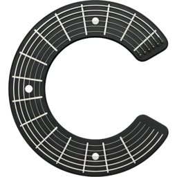

<p align="center">
  
</p>

<h1 align="center">Chordium</h1>

A modern, minimalist chord viewer app for beginner guitar players and hobbyists.

Chordium focuses on providing a distraction-free experience for learning and practicing guitar chords.

## 🎬 Demo


_Experience Chordium's clean interface, smart search, and intuitive chord display in action._

🎵 **[Try it live](https://chordium.vercel.app)**

## 🎯 Features

Chordium is designed with simplicity in mind, helping new guitar players and casual enthusiasts learn songs without visual clutter:

- **Install-less App (PWA)** - Works offline and installs like a native app
- **Clean Interface** - Distraction-free chord viewing experience
- **Smart Search** - Find songs and artists with intelligent caching
- **Transpose & Capo** - Shift chords to any key or capo position on the fly
- **Auto-scrolling** - Practice at your own pace with speed controls
- **Dark Mode** - Light, dark, and system theme options
- **Mobile-friendly** - Learn on-the-go with responsive design
- **File Upload** - Import your own chord sheets with metadata extraction

## 🎸 Jam Sessions

Share a chord sheet with other players instantly, fully **offline** on a local network..

The host opens a chord sheet and taps **Share** to generate a QR code. Anyone who scans it loads the same chord sheet on their device. 

Join a session by tapping the scan button in the header.

## 💻 Tech Stack

### Frontend

- **React** + **TypeScript** - Modern UI with type safety
- **Vite** - Fast build tool and development server
- **Tailwind CSS** + **shadcn/ui** - Beautiful, accessible components
- **React Router** - Client-side navigation
- **@tanstack/react-query** - Data fetching and state management

### Backend

- **Vercel Serverless Functions** - API endpoints in `frontend/api/`
- **Neon** - PostgreSQL database (via Vercel Postgres)
- **@sparticuz/chromium** + **Puppeteer** - Headless scraping for chord sheets

### Development

- **Turborepo** - High-performance build system for monorepos
- **npm Workspaces** - Monorepo dependency management
- **@chordium/types** - Shared TypeScript types published to npm
- **Vitest** + **Jest** + **Cypress** - Comprehensive testing

## 📚 Documentation

| Topic                                                          | Description                                        |
| -------------------------------------------------------------- | -------------------------------------------------- |
| [Getting Started](./docs/getting-started.md)                | Installation, setup, and development commands      |
| [Testing](./docs/testing.md)                                | Testing frameworks, running tests, and guidelines  |
| [Error Handling](./docs/error-handling.md)                  | Error recovery and user-friendly error messages    |
| [Project Structure](./docs/project-structure.md)            | Codebase organization and architecture             |
| [Deployment](./docs/deployment.md)                          | Frontend and backend deployment guides             |
| [Contributing](./CONTRIBUTING.md)                           | How to contribute to the project                   |
| [Backend API](./backend/README.md)                          | Backend documentation and API reference            |
| [Search Guide](./docs/search-guide.md)                      | Smart search functionality details                 |
| [Monorepo](./docs/MONOREPO.md)                              | Monorepo architecture and workspace management     |
| [Cache Architecture](./docs/cache-architecture.md)          | Frontend caching system design and implementation  |
| [Build Optimizations](./docs/build-optimizations.md)        | Performance optimizations and bundle configuration |
| [PWA Development](./docs/getting-started.md#pwa-development) | PWA setup, development workflow, and features      |
| [Technical Decisions](./docs/technical-decisions/README.md) | Key architectural decisions and rationale          |

## 🚀 Quick Start

```sh
# Clone and install
git clone https://github.com/arthurboss/chordium.git
cd chordium
npm install
```

See [Getting Started](./docs/getting-started.md) for development setup and commands.

## 📝 License

This project is licensed under the MIT License - see the [LICENSE](./LICENSE) file for details.
